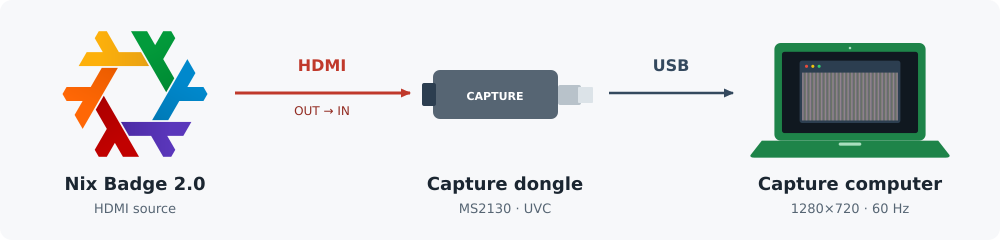

# Check an HDMI capture dongle

Use a known-good HDMI source first (a laptop or console), then the badge.
Connect source HDMI out → dongle HDMI in → capture computer USB. Confirm which
source is connected; a laptop's image says nothing about badge output. Use 1280×720 at 60 Hz for the badge test.



Enter `nix develop .#display`. Find the video capture node:

```sh
python3 tools/display/capture-device.py --list
capture_device=$(python3 tools/display/capture-device.py) || exit
```

Discovery checks supported USB IDs and V4L2 capture/streaming capabilities;
it excludes metadata nodes and webcams, and refuses an ambiguous selection.
For no result, check USB enumeration, device permissions and cable/port before
streaming. No badge commands or USB resets are performed.

Stop other capture programs. Leave at least 20 seconds between closing one
stream and opening another; the MS2130 can disconnect when reopened rapidly.

### Prepare the recording

Use one shell for preparation, recording and validation so the variables and
exit statuses remain available. Create a new output directory:

```sh
capture_out=capture-01
mkdir "$capture_out" || exit
```

### Record

For a badge trial, first start the guarded hold as described in
[the display guide](mainline-display.md#one-hardware-validation-cycle).
Run this block immediately after `DISPLAY_HOLD_BEGIN`; for a known-good
source, run it while that source is displaying its test image. Record once,
retaining startup frames and diagnostics:

```sh
timeout -k 2 22 ffmpeg -nostdin -hide_banner -loglevel error -xerror \
  -f v4l2 -input_format mjpeg -video_size 1280x720 -framerate 60 \
  -i "$capture_device" -t 15 -c copy -n "$capture_out/clip.mkv" \
  2> "$capture_out/ffmpeg.log"
capture_rc=$?
ffprobe -v error -select_streams v:0 -show_frames \
  -show_entries frame=best_effort_timestamp_time -of json \
  "$capture_out/clip.mkv" > "$capture_out/frames.json" \
  2>> "$capture_out/ffmpeg.log"
probe_rc=$?
printf 'ffmpeg=%s ffprobe=%s\n' "$capture_rc" "$probe_rc" > "$capture_out/exits.txt"
python3 tools/display/sample-capture.py "$capture_out/clip.mkv" \
  "$capture_out/frames.json" "$capture_out/samples"
```

Both return codes must be zero and the error log empty. Open the clip and the
sample PNGs: verify that they show the known source, at the requested size,
through the full recording. A black image or FFmpeg exit 0 alone does not
establish a working HDMI input. The oracle's `hit` means “not recognized as
flat or pinstripe”; it is normal for a desktop or colour-bar source.

For the badge's pinstripe test, additionally run:

```sh
python3 tools/display/validate-capture.py "$capture_out/frames.json" \
  "$capture_out/samples/samples.json" "$capture_out/ffmpeg.log" \
  --ffmpeg-exit "$capture_rc" --ffprobe-exit "$probe_rc"
```

Exit 0 requires strict capture timing and 13/13 settled pinstripe samples;
exit 2 retains anomalies confined to the first 2 seconds without passing; exit 1 fails. Retain
the whole clip and startup samples even on failure. Do not retry automatically.
See [display validation](mainline-display.md) for the separate badge identity,
register and stop checks. A dongle test alone does not validate the driver.

The illustration uses the PCB repository's rainbow variant of the NixOS Logo
by Simon Frankau, Tim Cuthbertson, Daniel Baker and NixOS Project contributors
([CC BY 4.0](https://github.com/NixOS/branding/tree/85d345cad174abf5addcf74c67a8b235beee3a24#license-and-attribution)).
Its geometry and colours are unchanged; the capture layout is new. The SVG
records the exact PCB source.
